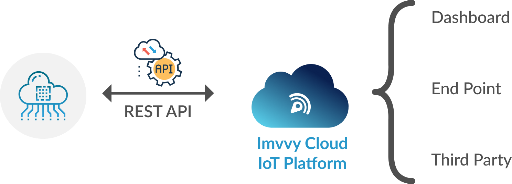
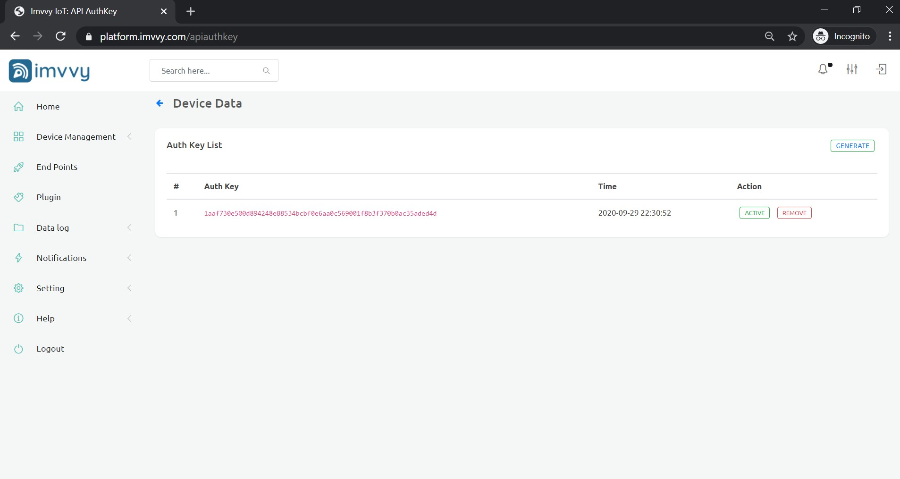

# HTTP DEVICES

There are some projects that require the integration of HTTP API SERVICES. This section explains the usage of "HTTP device", that allows receiving data via REST API from any source and is able to create a connection with the Imvvy server and send an HTTP request by taking advantage of all Imvvy IoT Platform features such as display real-time data in dashboards.

The next section explains how to create and configure the HTTP device profile on the Imvvy IoT Platform and how to link it with the data source.

## Creating HTTP Device Profile

### 1: Add HTTP Device in Dashboard

### 2: API Auth key

Once the profile is created you will be able to find it in the devices list. Next you need to create an API Auth key \(If you have not created earlier\).

However, when this page is accessed for the first time \(before making the first call to the REST API\) the page will be blank.

