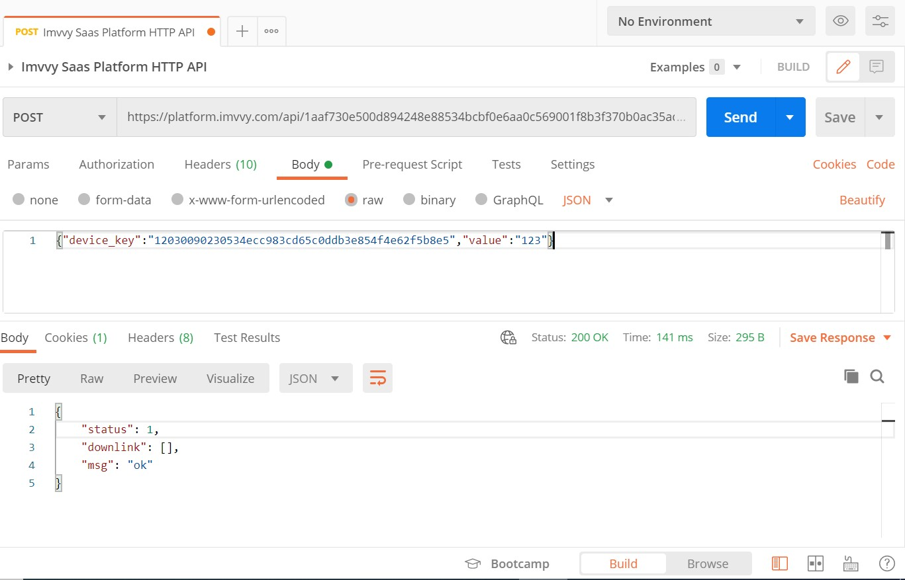
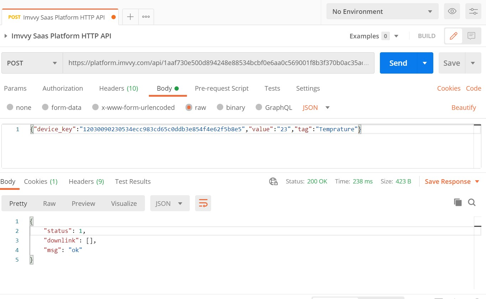
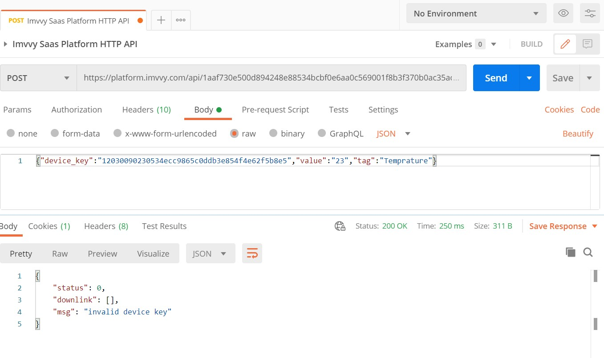

# HTTP API IMPLIMENTATION

* **Request URL:** [https://platform.imvvy.com/api/+](https://platform.imvvy.com/api/+) **Auth Key**
* **Method:** POST 
* **Datatype:** JSON

eg. JSON:

```text
{
"device_key":"1203009023053f4e62f5b8e5",
"value":"2",
"tag":"Temprature"
}
```


## Using Postman / HTTP request manager

This service provides a useful way to test HTTP integration in a simple way. It is necessary to follow the steps listed below to configure a request: -



* Select &lt;POST&gt; message type 
* Device Key and value are mandatory, you will get the device key from the Device Profile and the value will be the one which you send. After this, you can add multiple values according to your requirement. 
*  Pass API Auth key in URL 
* Create a Content-type header with JSON type 
* Write some valid JSON data and send your query

## Success Response 

As shown in the below image, you will receive a 200 OK status message and return JSON status 1



## Error Response

If the user sends the wrong parameters, he will receive return status 0



