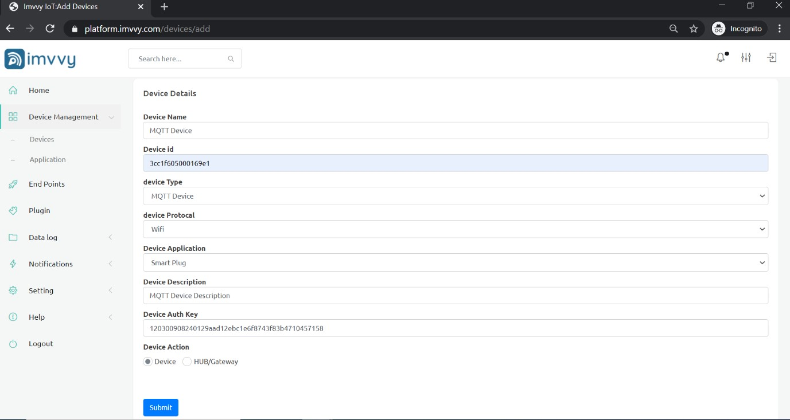
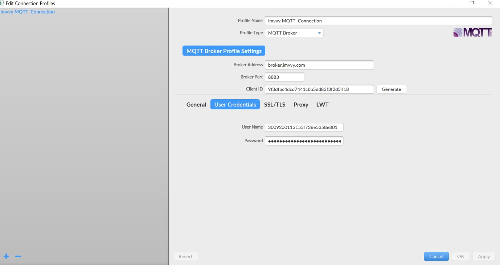
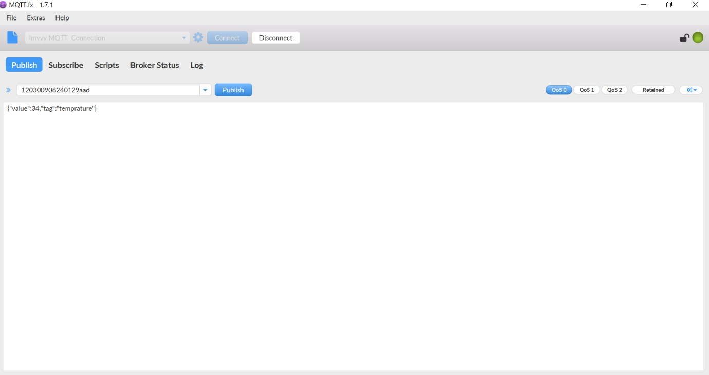
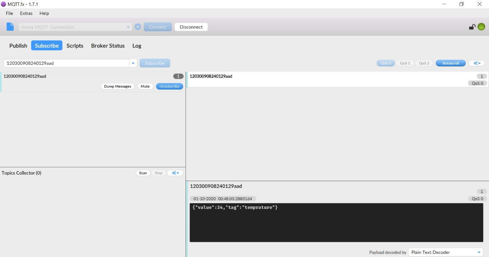
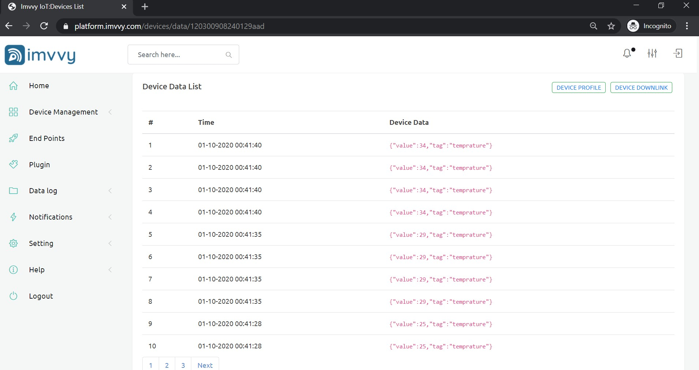

# MQTT IMPLEMENTATION

By creating the MQTT device on Imvvy IoT Platform, you can access the device on device list of the platform. The device is available on the "devices" section of the main menu by clicking on the "Add device" button:

 Once you click the add device button the "new device form" will appear, asking for the following device information as per the picture below.

* **Device Type:** MQTT device should be selected. 
* **Device ID:** Must be unique within your devices assign by you.
* **Device description:** Additional information that may help to identify each device. 
* **Device Auth Key:** Is the device security password, it is randomly created by Imvvy IoT Platform. 
* When all the information has been entered, clicking "Add Device" button will create a new device profile in the device list.

> Congratulations!! your device registration has been completed successfully.

## Configure MQTT with your device

Configure any device or program with Imvvy IoT Platform and start Publishing or subscribing data. The following parameters must be introduced in the client in order to create the connection:-

* **Broker Address:** The Imvvy instance domain \(i.e. brocker.imvvy.com\) 
* **Broker Port:** 8883 for SSL/TLS 
* **User Name:** Account User name 
* **Client ID:** User can use Device Auth key or any unique ID according to his convenience 
* **Topic For Publish:** Device Auth key Topic 
* **Topic For Subscribe:** AUTH key/subscribe 
* **Password:** Device Auth key "Device Credentials" parameter 
* **MQTT version:** Currently Imvvy IoT Platform supports 3.1 or 3.1.1 versions of the protocol 
* It is recommended to use SSL/TLS communication using the port **8883**

Once the client has been configured, it should be able to publish and subscribe data with the server, for example, using the MQTT.fx client:

* Open MQTT.fx add all credentials in MQTT.fx

MQTT broker has been designed to support multi-tenancy by default.

* Topic Setting and publish message:

Make sure your topic and Device Auth key are same.

* Data Subscribe:

Dashboard Realtime Data View:

