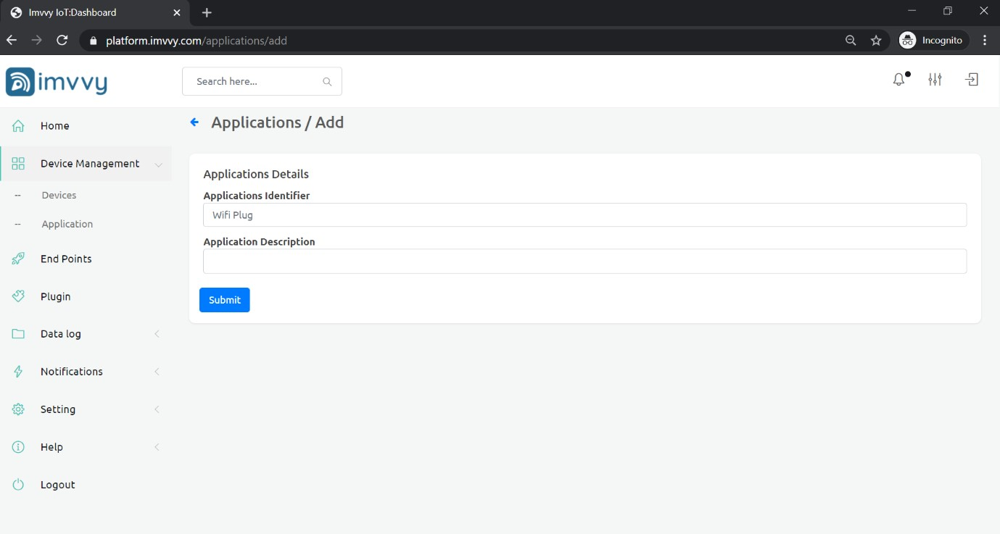
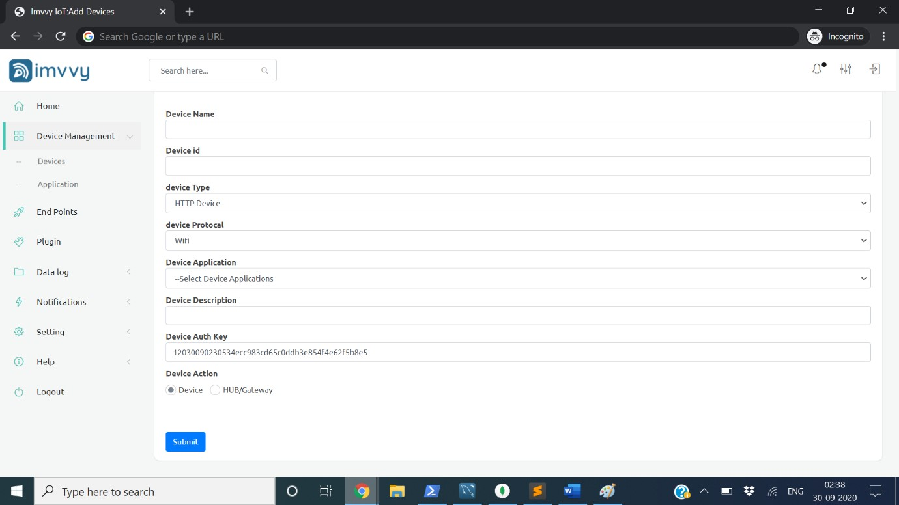
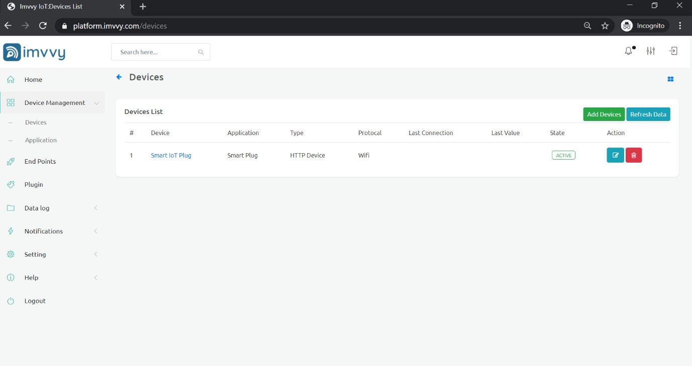

# Getting started

## Create Application

You need to add an application before adding devices. Application is like making a group for devices. 

* Application identifier eg: Wifi Plug, Door Sensor, Smart Hub, etc.
* Enter application description

## Add Devices

Go to "Devices" menu tab, click on "New device" button, and fill the inputs in the form with the:-

* Device Name
* Device ID
* Device Type eg. HTTP, MQTT \(you want to integrate Imvvy Platform with your device with HTTP/MQTT \)
* Device Protocol \(Choose your device protocol\)
* Device Application \(Choose the device applications you have created earlier\)
* Device Description
* Device AUTH key \(Unique Device AUTH key generated by Imvvy IoT Platform\)

## Device Dashboard

Once your device is successfully registered you can check your device dashboard for registered devices.

> [Create your free account](https://platform.imvvy.com/) ****and learn below how to use Imvvy IoT Platform.

