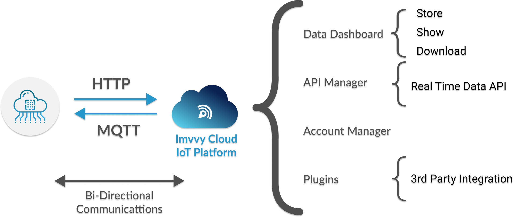
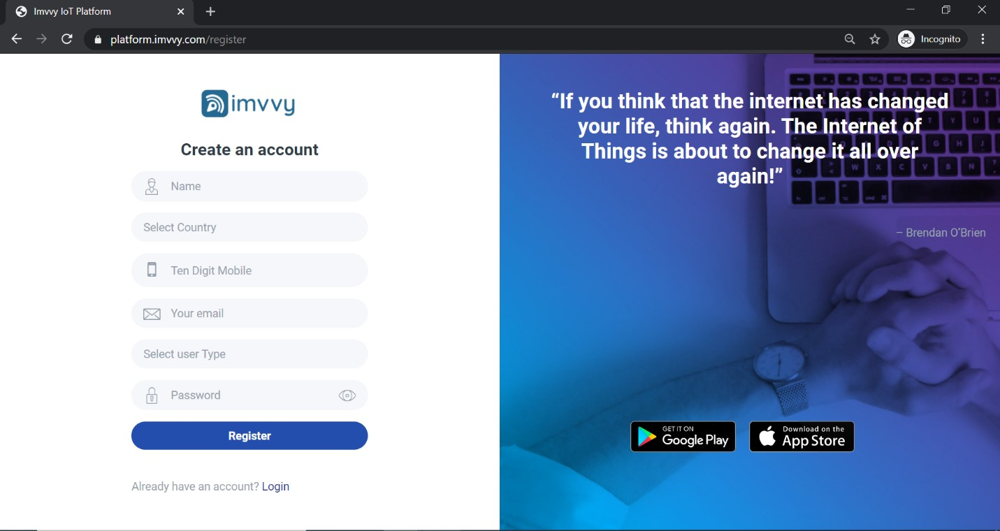
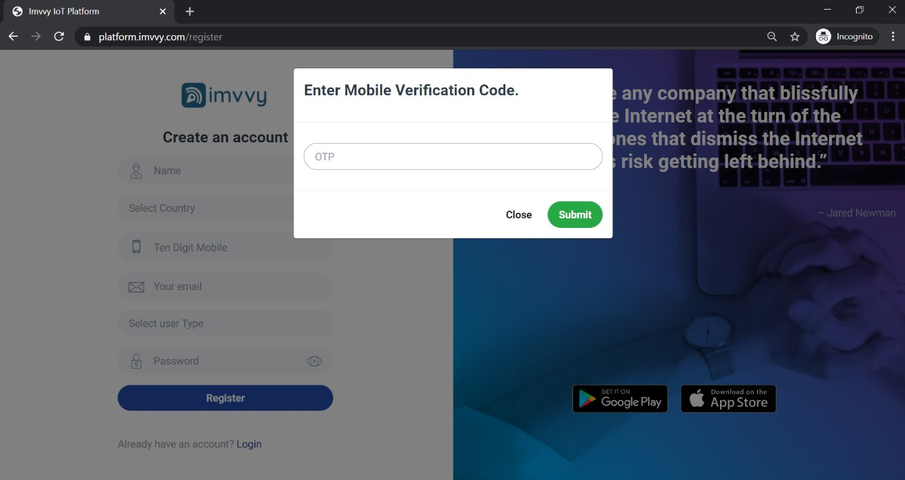
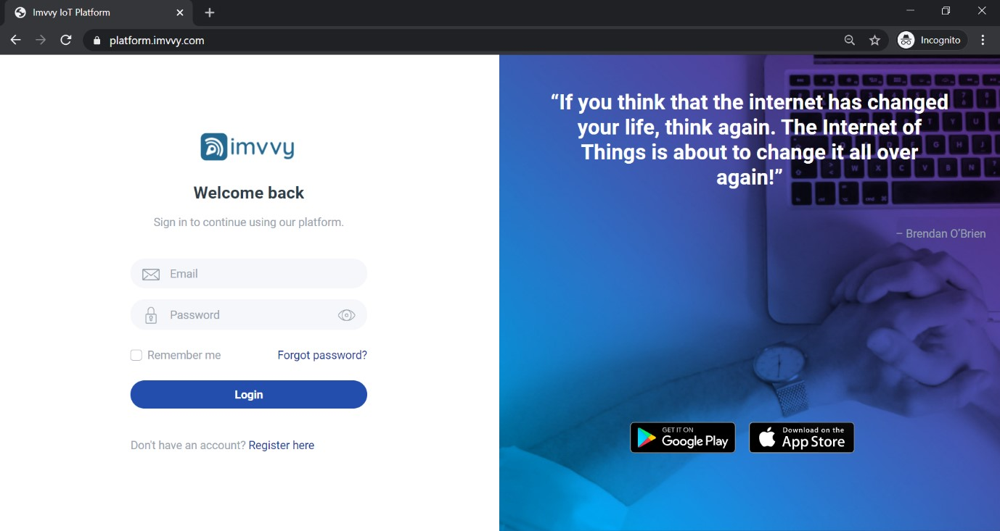
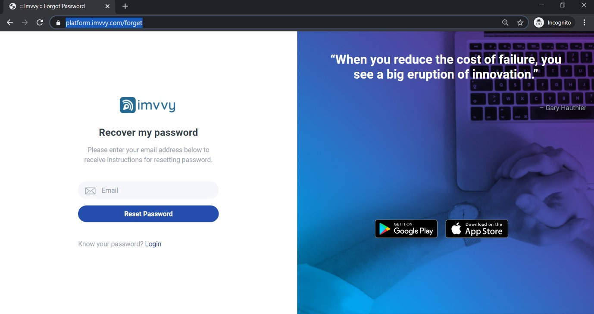

# Imvvy IoT Architecture

Imvvy IoT platform comprises of two main components: -

1. Backend \(The actual IoT server\)
2. Web-based frontend dashboard

Using any computer or a smartphone the platform’s components assist in simplified working using all the features. 

The image below represents the core features provided by this platform to create IoT projects.

Imvvy IoT platform is fully compatible with most of the devices available in the market.. We allow the user to create bidirectional communication with Arduino, Raspberry Pi, ESP Modules or MQTT devices and other internet API data resources.

Our dashboard provides real-time data and the user can easily download the data files. The user can download real-time data on his server or he can also pull by API or with WebHook.

> [**Create a free Imvvy IoT Platform account**](https://platform.imvvy.com/) ****and learn below how to use Imvvy IoT Platform.

##  Create a free Imvvy IoT Platform  account

To start working with the Imvvy IoT Platform, you need to [create a free account](https://platform.imvvy.com/) in our cloud IoT platform. To create a free account you need to follow the following steps listed below to configure and connect your first IoT device with Imvvy cloud:-

> [**Create your free account**](https://platform.imvvy.com/) ****and learn below how to use Imvvy IoT Platform.

### Registration

Open the Imvvy IoT Platform registration page, enter your full name, select your country, enter your ten-digit mobile number, enter your email id, select your user type and choose a password with a minimum length of five characters.

### Mobile OTP Verification

After your registration is completed you will receive a four-digit OTP in your registered Mobile No.

Once you have received the OTP varication and have verified it your registration will be completed.

### Login

To log in, you will need to enter your registered email id and password.

### Forget Password

If you have forgotten your password enter your registered email-id, you will receive an email to reset the new password.

